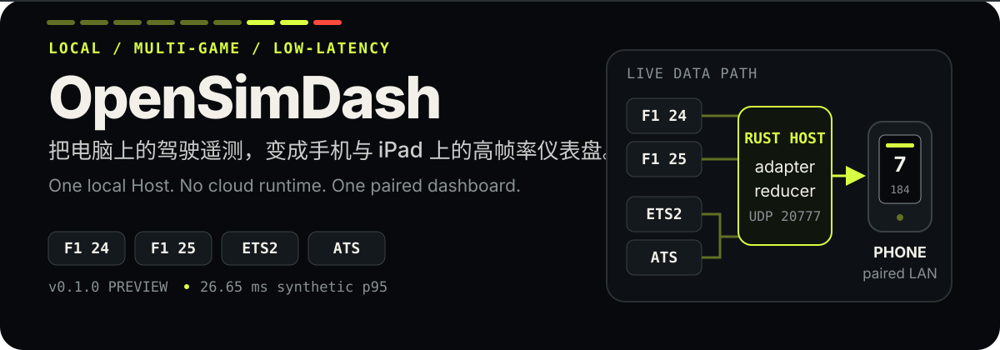

<p align="center">
  
</p>

<p align="center">
  <strong>Windows / macOS 桌面控制中心 → 同一局域网中的手机或 iPad。</strong><br>
  无云端运行依赖，无 CDN，无账户；安装、扫码、驾驶。低内存无头 Host 仍随包提供。
</p>

<p align="center">
  <a href="https://github.com/LeoAndJellyfish/OpenSimDash/releases/latest">下载预览版</a>
  · <a href="./docs/quickstart-multi-game.md">快速开始</a>
  · <a href="./docs/data-paths-and-scs-packet.md">数据链路与协议图解</a>
  · <a href="./docs/README.md">文档</a>
  · <a href="./LICENSE">Apache-2.0</a>
</p>

<p align="center">
  <a href="https://github.com/LeoAndJellyfish/OpenSimDash/actions/workflows/ci.yml"></a>
</p>

## 现在支持什么

| 游戏 | 电脑端输入 | 主要字段 | 需要注意 |
| --- | --- | --- | --- |
| **F1 24** | 游戏原生 UDP，format `2024` | 驾驶、圈速/比赛状态、赛事事件、燃油/ERS、轮胎、损伤、天气与处罚 | 严格解析 packet `1/2/3/6/7/10` |
| **F1 25 + 2026 Season Pack** | 游戏原生 UDP，format `2025` 或 `2026` | 包含 F1 24 字段并增加轮胎起泡；2026 另含主动空气动力学与超车状态 | 两种 mode 按各自车辆数与精确包长解析；2026 支持 packet `16` |
| **Euro Truck Simulator 2** | 随包 SCS SDK 插件 → loopback UDP | 驾驶、导航、道路限速、油量/续航、灯光与配送任务 | 首次使用需复制插件并接受游戏 SDK 提示 |
| **American Truck Simulator** | 同一 SCS SDK 插件 → loopback UDP | 与 ETS2 相同 | v2 插件只向 `127.0.0.1:20777` 非阻塞发送；Host 兼容 v1 |

四种内置游戏输入与已安装的第三方插件共用一个 Rust Host 与 Dashboard。Host 默认自动识别来源，并在当前来源活跃时保持两秒粘性；Dashboard 根据遥测中的 `gameId` 自动切换视觉、状态语义和该游戏独立保存的自定义布局。排障或多游戏并行时，可固定为任一内置或已安装插件 ID。

游戏支持遵循同一份版本化插件 manifest。桌面控制中心可安装第三方 `.osd-plugin`；跨平台 WASM decoder 在无 WASI、无 Host imports 且受内存/fuel/输入输出上限约束的沙箱中运行。数据源、设置步骤、主题、独立布局和适用组件都会从插件元数据自动出现，开发方法见[游戏插件开发指南](./docs/plugin-development.md)。

> [!IMPORTANT]
> 项目从 `v0.4.1` 起正式使用 **OpenSimDash** 名称。插件包必须使用 `.osd-plugin` 与 `osd_*` WASM ABI；旧插件、环境变量和系统标识不提供兼容别名。首次启动会把已有设置、配对设备、布局和游戏目录发现状态复制到新资料目录，但不会迁移不兼容插件、运行时锁或日志。安装程序尚未使用商业 Windows 证书或 Apple Developer ID/notarization，因此仍明确标记为 preview；真实游戏与多种手机/iPad 的未完成验收如实保留在[发布检查清单](./docs/release-checklist.md)中。

## 从下载到第一块仪表盘

1. 从 [Releases](https://github.com/LeoAndJellyfish/OpenSimDash/releases/latest) 下载 Windows x64 安装器，或与你 Mac 架构匹配的 DMG。
2. 启动 **OpenSimDash** 桌面控制中心。macOS preview 首次运行可能需要在“隐私与安全性”中允许打开。
3. 打开“设备与配对”，让手机/iPad 与电脑连接同一局域网并扫描一次性二维码。
4. 按游戏配置数据源：
   - **F1 24/25：** UDP Telemetry `On`，IP `127.0.0.1`，端口 `20777`，`60Hz`；F1 25 的原始 **2025** 与 **2026 Season Pack** mode 均可。
   - **ETS2/ATS：** “游戏设置”会通过 Steam 库与 AppID 自动定位游戏；未找到时可手动选择目录。安装内置 bridge 后，重启游戏并接受 SDK 提示。

安装目录同时包含独立的 `opensimdash-host`（Windows 为 `.exe`）。GUI 与 CLI 共用一个实例锁和配置目录；任一已经运行时，另一个会说明当前所有者并退出，而不会争抢 `20777/20778`。

精确目录、防火墙、异机配置和分段排障见[多游戏快速开始](./docs/quickstart-multi-game.md)。

<details>
<summary><strong>从源码构建</strong></summary>

前置条件：Node.js 22+、仓库指定的 Rust stable；构建 ETS2/ATS 插件还需要 CMake 3.20+ 与 64 位 C++17 编译器。

```powershell
npm ci
npm run build:desktop
```

只构建/运行无头模式：

```powershell
npm run build:host
.\target\release\opensimdash-host.exe
```

</details>

## 数据如何到达手机

<p align="center">
  <a href="./docs/data-paths-and-scs-packet.md"></a>
</p>

F1 直接发送官方 UDP；ETS2/ATS 由游戏加载最小 SCS 插件，把 callback 编码为固定 188-byte v2 本机数据报（Host 仍接受 44-byte v1）。Host 逐字段安全解析，并交给每游戏独立 reducer；连续状态只保留最新值，离散事件进入有界 ring，最终通过已配对的本地 WebSocket 发布。

这些长度不能跨游戏或 mode 混用：F1 24 与原始 F1 25 的 Car Telemetry 都是 1352 bytes，但 Car Damage 分别为 953 和 1041 bytes；2026 Season Pack 的 Car Telemetry 为 1448 bytes，并新增 269-byte Car Telemetry 2。SCS 的 188-byte v2 也是独立版本，不是把扩展字段塞入旧 44-byte v1。三套 F1 精确 packet 矩阵与两版 SCS offset 见下方教材式图解。

[打开教材式图解：四游戏链路、F1 精确包长、SCS v1/v2 数据包阵列与 ETS2LA 方案对照 →](./docs/data-paths-and-scs-packet.md)

## 为驾驶场景做的取舍

| 目标 | 实现 |
| --- | --- |
| **低延迟** | 有界 latest-state 路径；Windows release 合成 UDP→WebSocket p95 `26.86 ms`，门槛 `<100 ms` |
| **高帧率** | 前端只有一个 `requestAnimationFrame` 调度器；遥测包不会触发整棵 Preact 树重渲染 |
| **稳定** | Rust 安全解析、精确长度/版本校验、无 `unsafe` adapter；SCS 帧回调不锁、不等待、不解析网络输入 |
| **本地与隐私** | 遥测不离开电脑/局域网；一次性配对、设备 session、Origin/Host 校验、严格 CSP |
| **可维护** | 游戏协议 → `GameAdapter` → 统一遥测模型 → Dashboard；前端不堆积游戏特判 |
| **可定制** | 每游戏独立响应式布局；拖动/缩放、撤销重做、主题、原子保存与安全 JSON 导入导出 |

F1 采用项目自己的 **Trackside Signal System**：转速灯地平线、中央大档位和 DRS 状态；ETS2/ATS 自动切为速度优先的长途布局、低转速量程、道路色彩和 SCS bridge 状态。动画只更新合成友好的属性，并尊重 `prefers-reduced-motion`。

## 诊断：先判断断在哪一段

Host 运行时提供两个仅含脱敏状态的端点：

- `http://127.0.0.1:20778/api/v1/health`
- `http://127.0.0.1:20778/api/v1/diagnostics`

| 看到的状态 | 含义 |
| --- | --- |
| `packetsReceived = 0` | Host 尚未收到游戏 UDP；检查游戏设置、插件路径、端口或进程 |
| received 增长、`packetsRecognized = 0` | 已到 Host，但 format/version/固定游戏选择不匹配 |
| `activeAdapter` 正确 | 游戏读取与 adapter 已成功，继续检查配对/WebSocket/页面状态 |
| 页面 `DATA STALE` | 游戏暂停、进菜单或数据源停止；恢复驾驶后自动更新 |

诊断不会导出配对令牌、设备 session、源 IP、玩家名、游戏路径或原始数据报。

## 开发与验证

```powershell
cargo fmt --all -- --check
cargo clippy --locked --workspace --all-targets -- -D warnings
cargo test --locked --workspace
npm run check:web
npm run test:web
npm run build:web
npm run build:scs-plugin
npm run package:host
npm run test:package-smoke
npm run test:host-latency
```

`test:package-smoke` 会启动包内 Host，并依次验证 `f1-24/2024 → f1-25/2025 → f1-25/2026 → ets2 → ats`。另有默认两小时、四客户端、60 Hz 的 `npm run test:host-soak`，不把短测试冒充长期稳定性结果。

## 项目地图

```text
apps/       Rust Host 与 Tauri/Preact 桌面控制中心
crates/     Plugin/Adapter API、WASM runtime/SDK、telemetry、protocol、config
plugins/    内置游戏 manifest 与最小 SCS Telemetry SDK 原生桥接插件
web/        Preact Dashboard、Editor 与 Widget SDK
schemas/    版本化 JSON Schema 和生成类型
tests/      集成、fixture 与性能门禁
tools/      回放、类型生成、打包和发布冒烟
docs/       架构、ADR、协议、首启、图解与发布清单
```

推荐阅读：

- [游戏数据链路与 SCS 数据包协议图解](./docs/data-paths-and-scs-packet.md)
- [第三方游戏插件开发、WASM ABI 与打包指南](./docs/plugin-development.md)
- [标准游戏插件系统设计](./docs/plans/2026-08-15-game-plugin-system-design.md)
- [多游戏输入与适配器设计](./docs/plans/2026-08-12-multi-game-adapters-design.md)
- [F1 25 2026 Season Pack 与按游戏前端设计](./docs/plans/2026-08-12-f1-25-2026-season-pack-design.md)
- [系统架构设计](./docs/plans/2026-08-11-opensimdash-architecture-design.md)
- [视觉与动效设计](./docs/plans/2026-08-11-f1-dashboard-visual-design.md)
- [ADR：为什么采用版本化本机桥接](./docs/adr/0007-versioned-local-game-input-bridges.md)
- [ADR：为什么桌面端嵌入同一个 Host](./docs/adr/0008-tauri-desktop-embedded-host.md)
- [F1 24](./docs/protocols/f1-24.md)、[F1 25](./docs/protocols/f1-25.md)、[SCS bridge v1](./docs/protocols/scs-bridge-v1.md) 与 [v2](./docs/protocols/scs-bridge-v2.md) 协议边界
- [发布检查清单](./docs/release-checklist.md)

## License

OpenSimDash 使用 [Apache License 2.0](./LICENSE)：允许使用、修改、分发和商业使用，并提供明确专利授权；分发时须保留许可证与声明。

原生 SCS bridge 使用的官方 SCS SDK 1.14 头文件保留 SCS Software 的独立宽松许可。来源、归档哈希和许可位于 [`plugins/scs-telemetry-bridge/vendor/scs-sdk-1.14/`](./plugins/scs-telemetry-bridge/vendor/scs-sdk-1.14/)，并随包含插件的发布包分发；归属说明见 [NOTICE](./NOTICE)。
