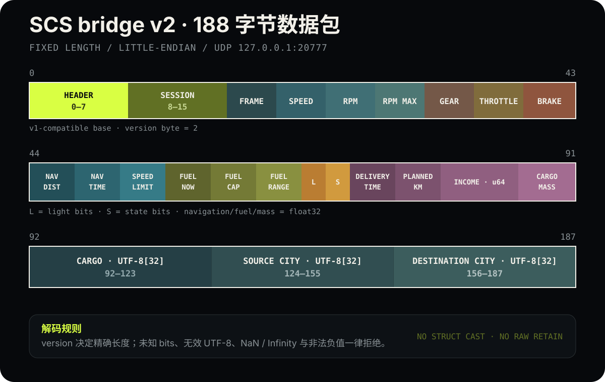

# 游戏数据链路与数据包协议图解

本文说明四款游戏如何把遥测送到手机，列出 F1 24、原始 F1 25 与 2026 Season Pack 三套精确 UDP packet 矩阵，并用可缩放的教材式图示展示 ETS2/ATS 原生桥接插件的 v1 44-byte 兼容包和当前 v2 188-byte 数据包。图中所有连接都是本机或同一局域网连接；运行时不经过云端服务。

## 四款游戏如何进入同一个 Dashboard

  

链路分为两种：

1. **F1 24 / F1 25：游戏原生 UDP。** 游戏按官方格式直接把数据报发到 Host 的 UDP `20777`。F1 24 adapter 只接受 format `2024`；F1 25 adapter 依据公共头精确选择原始 `2025` 或 Season Pack `2026` 布局，不按相近偏移猜测。
2. **ETS2 / ATS：SCS SDK 回调桥接。** 游戏加载随包插件，在未暂停帧的 `FRAME_END` 回调中，把当前状态编码为固定 188-byte v2 报文，并非阻塞地发到同机 `127.0.0.1:20777`。Host 仍接受旧插件的 44-byte v1 报文。

四条输入在 `AdapterRegistry` 中都有独立 adapter/reducer。自动模式对当前来源保持两秒粘性，防止同时运行多款游戏时画面来回切换；也可以用 `OPENCARPANEL_GAME=f1-24|f1-25|ets2|ats` 固定来源。随后 Host 把统一遥测通过已配对的 HTTP/WebSocket 送到手机或 iPad；Dashboard 使用统一模型中的 `meta.gameId` 自动选择游戏视觉与独立用户布局，不从某个速度/RPM 字段反向猜游戏。

## F1 原生 UDP：三套精确 wire layout

三种 mode 都使用 29-byte packed、小端公共头和 `packetVersion = 1`，但车辆数、单车 entry 和总包长并不相同。Host 先按 `packetFormat` 选择布局，再验证 packet ID 与精确总长；相近长度不会被当作兼容格式。

| Packet | ID | F1 24 / format 2024 | F1 25 / format 2025 | 2026 Season Pack / format 2026 |
| --- | ---: | ---: | ---: | ---: |
| Session | `1` | 753 bytes | 753 bytes | 926 bytes |
| Lap Data | `2` | 1285 bytes（22 × 57 + 2-byte trailer） | 1285 bytes（22 × 57 + 2-byte trailer） | 1399 bytes（24 × 57 + 2-byte trailer） |
| Event | `3` | 45 bytes | 45 bytes | 45 bytes |
| Car Telemetry | `6` | 1352 bytes（22 × 60 + 3-byte trailer） | 1352 bytes（22 × 60 + 3-byte trailer） | 1448 bytes（24 × 59 + 3-byte trailer） |
| Car Status | `7` | 1239 bytes（22 × 55） | 1239 bytes（22 × 55） | 1445 bytes（24 × 59） |
| Car Damage | `10` | 953 bytes（22 × 42） | 1041 bytes（22 × 46） | 1133 bytes（24 × 46） |
| Car Telemetry 2 | `16` | — | — | 269 bytes（24 × 10） |

表中括号只描述公共头之后的主要数组和尾部字段，总长度已经包含 29-byte header。原始 F1 25 的 Car Damage entry 比 F1 24 多 4-byte 轮胎起泡数组；2026 把车辆数提高到 24、把 Car Telemetry 的发动机温度从 `u16` 改为 `u8`、在 Car Status 增加 4-byte ERS harvesting limit，并新增主动空气动力学/超车状态的 packet `16`。详细字段和厂商资料入口见 [F1 24 协议](protocols/f1-24.md)与 [F1 25 / 2026 协议](protocols/f1-25.md)。

## v1：44 字节基础包逐 byte 看

  

最上方的 `00..43` 是从零开始的 byte offset。彩色长条仍是一段连续数组；竖线表示每个单独字节，颜色和标签表示字段边界。所有整数和 IEEE-754 `float32` 均为小端序。

| Offset | 长度 | Wire type | 字段 | 语义与校验 |
| ---: | ---: | --- | --- | --- |
| `0` | 4 | `[u8; 4]` | magic | 固定为 ASCII `OCP\0` |
| `4` | 1 | `u8` | version | 固定为 `1` |
| `5` | 1 | `u8` | game | `1 = ETS2`，`2 = ATS` |
| `6` | 1 | `u8` | flags | v1 必须为 `0` |
| `7` | 1 | `u8` | reserved | v1 必须为 `0` |
| `8` | 8 | `u64` | session nonce | 每次插件初始化生成；Host 只把它视为不透明会话标识 |
| `16` | 4 | `u32` | frame sequence | 插件初始化周期内递增，允许自然回绕 |
| `20` | 4 | `f32` | signed speed | 米/秒；负数代表倒车，速度表显示其幅值 |
| `24` | 4 | `f32` | engine RPM | 必须有限且处于 `0..65535` |
| `28` | 4 | `f32` | RPM limit | 车辆配置的转速上限；`0` 表示暂未知 |
| `32` | 4 | `i32` | displayed gear | `<0 = R`，`0 = N`，`1..255 = 前进档` |
| `36` | 4 | `f32` | effective throttle | 必须有限且处于 `0..1` |
| `40` | 4 | `f32` | effective brake | 必须有限且处于 `0..1` |

选择固定长度而不是直接发送 C++ struct，能避开编译器 padding、alignment 与 ABI 差异。Rust Host 会逐字段读取，并严格拒绝错误 magic、长度、版本、游戏 ID、保留位、`NaN`/`Infinity` 和越界踏板值；原始数据报不会被保留。v1 现作为向后兼容输入保留。

## v2：188 字节扩展包分段图

  

v2 保留 offset `0..43` 的所有 v1 字段，把 version 改为 `2`，再追加以下区域：

| Offset | 长度 | 内容 |
| ---: | ---: | --- |
| `44..55` | 12 | 剩余导航距离、时间和当前道路限速，均为 `f32` |
| `56..67` | 12 | 当前油量、油箱容量和预计续航，均为 `f32` |
| `68..71` | 4 | 9 个灯光 bits 与 4 个状态 bits |
| `72..91` | 20 | 交付期限、计划里程、收入、货物质量 |
| `92..123` | 32 | 货物名称，UTF-8 + NUL padding |
| `124..155` | 32 | 起点城市，UTF-8 + NUL padding |
| `156..187` | 32 | 目的地城市，UTF-8 + NUL padding |

灯光 bits 覆盖示宽、近光、远光、警示灯、刹车灯、倒车灯、左右转向和双闪；状态 bits 表示低油量、任务有效、货物已装载和特殊运输。精确 offset、wire type、SDK channel 与校验规则见 [SCS bridge v2 协议](protocols/scs-bridge-v2.md)。

## 为什么没有直接复用 ETS2LA 的共享内存

ETS2LA 随包使用 `truckermudgeon/scs-sdk-plugin` 的 RenCloud fork，把 SCS callback 写入 32 KiB `SCSTelemetry` shared memory，并由主程序约以 60 Hz 读取。这是成熟且字段丰富的方案，但默认依赖第三方布局会把版本和故障边界交给外部项目。

OpenCarpanel 选择自有、版本化的 loopback UDP bridge：游戏进程内只保留固定状态和非阻塞发送，解析、诊断与网络服务都留在 Rust Host。v2 直接从同一套官方 SDK callbacks/configuration attributes 提供 Dashboard 需要的导航、油量、灯光和任务字段。未来仍可以把 ETS2LA 共享内存兼容作为可选 ingress，让已安装该插件的用户避免重复安装，而不改变当前协议。

## 延伸阅读

- [SCS bridge v1 完整协议边界](protocols/scs-bridge-v1.md)
- [SCS bridge v2 完整协议边界](protocols/scs-bridge-v2.md)
- [多游戏输入与适配器设计](plans/2026-08-12-multi-game-adapters-design.md)
- [ADR-0007：版本化本机游戏桥接](adr/0007-versioned-local-game-input-bridges.md)
- [SCS Telemetry SDK 官方文档](https://modding.scssoft.com/wiki/Documentation/Engine/SDK/Telemetry)
- [ETS2LA telemetry reader](https://github.com/ETS2LA/ETS2LA/blob/main/ETS2LA.Game/Telemetry/Program.cs)
- [truckermudgeon/scs-sdk-plugin](https://github.com/truckermudgeon/scs-sdk-plugin)
