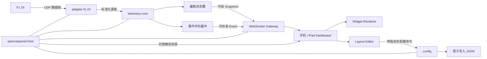

# OpenCarpanel 架构设计

- **状态：** Accepted
- **日期：** 2026-08-11
- **首个交付目标：** F1 24 + 局域网手机/iPad 仪表盘
- **运行边界：** 除软件更新外，运行时不依赖远程服务

> 本文保留最初 F1 24 基线及其决策背景。已实现的 F1 24/25、ETS2/ATS 输入注册表、SCS 原生桥接、当前目录结构与交付方式，以[多游戏输入与适配器设计](2026-08-12-multi-game-adapters-design.md)和 [ADR-0007](../adr/0007-versioned-local-game-input-bridges.md)为准。

## 1. 摘要

OpenCarpanel 采用 **Rust 模块化单体 Host + PWA-ready Web App**。电脑端 Host 接收游戏遥测，将每个游戏的专属协议转换成统一语义模型，再通过局域网 WebSocket 推送给手机或 iPad。Host 同时托管前端静态文件、布局配置 API、配对流程和本地诊断信息。

首个适配器使用 F1 24 官方 UDP 遥测规格。移动端首版以本地 HTTP Web App 交付；完整 PWA 安装和 Service Worker 需要 HTTPS 安全上下文，因此不作为 MVP 的阻塞条件。面板由内置组件、声明式数据绑定、响应式网格和主题令牌组成，不执行用户 JavaScript。

系统优先保证四件事：不积压旧遥测、游戏协议与 UI 隔离、故障可局部恢复、真实移动设备稳定 60 FPS。跨游戏能力来自明确的 Adapter API，而不是在 UI 中堆积游戏名称判断。

## 2. 需求与范围

### 2.1 功能需求

1. Host 可在 Windows 和 macOS 构建与运行；具体游戏可用性由适配器兼容矩阵单独说明。
2. 手机和 iPad 在同一局域网中扫码连接，无需安装原生应用。
3. 首个版本解析 F1 24 UDP 遥测，并能扩展欧卡、美卡、地平线和其他 F1 版本。
4. 用户可以添加、删除、拖拽、缩放组件，设置数据、单位、颜色和主题。
5. 布局可导入、导出并在 Host 本地持久化。
6. Host 提供连接、数据源、协议错误、延迟和客户端状态诊断。
7. 软件更新是唯一允许使用远程服务的运行边界。

### 2.2 非功能需求

| 维度 | MVP 验收目标 | 测量口径 |
| --- | --- | --- |
| 显示延迟 | p95 `< 100 ms`，目标 `< 50 ms` | Host 收到 UDP 数据报至客户端下一次完成渲染 |
| 帧率 | 普通设备稳定 60 FPS；高刷新率设备尽力达到 120 FPS | 真实手机/iPad 连续驾驶视图 10 分钟 |
| 掉帧 | 60 Hz 下掉帧率 `< 1%` | 不包含页面切后台和系统低电量强制降频 |
| Host 内存 | 活跃 RSS 目标 `< 50 MB` | Release 构建、一个适配器、一个客户端、稳定运行后 |
| 前端帧预算 | 总帧时间 p95 `< 16.7 ms`；JS p95 `< 3 ms` | 浏览器 Performance trace |
| 稳定性 | 两小时回放 soak test 无崩溃、无无界内存增长 | 固定 60 Hz fixture 流与四个客户端 |
| 兼容性 | 协议和配置均可版本化迁移 | 至少保留前一个稳定版本的读取兼容 |
| 隐私 | 默认无远程遥测、无云端账户、无云端配置 | 网络审计和发布清单 |

延迟指标不声称覆盖游戏内部物理计算到 UDP 发包的时间，因为该部分不受 OpenCarpanel 控制。

### 2.3 MVP 不包含

- 互联网远程查看或云同步。
- 原生 iOS/Android 应用。
- 任意 HTML、CSS 或 JavaScript 插件执行。
- 动态加载不受信任的 Rust/C ABI 游戏插件。
- 多用户账号、在线市场和社交功能。
- 为假设中的大规模用户引入微服务、消息队列或数据库服务器。

## 3. 方案比较与结论

| 方案 | 优点 | 代价 | 结论 |
| --- | --- | --- | --- |
| Rust 模块化 Host + 内嵌 Web App | 低常驻内存、单一部署、协议边界清楚、前端可复用 | Rust 二进制协议解析门槛较高 | **采用** |
| Tauri 桌面窗口 + Rust Core | 配置体验接近完整桌面应用 | 常驻 WebView 增加内存，桌面/移动入口易重复 | 暂不采用；托盘只打开浏览器配置页 |
| Node/Electron 全栈 | 开发快、单语言 | 安装体积和常驻内存较高 | 不符合轻量优先级 |

系统是模块化单体：运行时只有一个 Host 进程，但代码按协议、适配器、领域状态、持久化和传输拆分。小团队不承担分布式系统的部署和排障成本。

## 4. 总体架构



### 4.1 进程与线程边界

- 主进程负责生命周期、托盘、关闭信号和崩溃诊断。
- Async Runtime 负责 UDP、HTTP、WebSocket 和定时任务；禁止在异步任务中执行阻塞文件 I/O。
- 配置写入通过单一写入器串行化，在后台线程完成临时文件写入、同步和替换。
- 前端只有一个遥测接收循环和一个 `requestAnimationFrame` 渲染循环。
- MVP 不创建子进程；后续只有在第三方适配器隔离确有必要时重新评估。

## 5. 仓库与模块边界

```text
OpenCarpanel/
├─ apps/
│  └─ host/                    # 唯一桌面可执行程序
├─ crates/
│  ├─ adapter-api/             # 游戏适配器稳定契约
│  ├─ adapter-f1-24/           # F1 24 数据报解析与映射
│  ├─ telemetry-core/          # 统一状态、事件、会话和 capabilities
│  ├─ protocol/                # Host/浏览器消息和跨语言类型生成
│  └─ config/                  # 设置、布局、主题和迁移
├─ web/
│  ├─ dashboard/               # 驾驶视图、连接页和编辑器
│  └─ widget-sdk/              # 组件契约与内置组件注册表
├─ schemas/                    # 生成后的 JSON Schema 与协议快照
├─ tests/
│  ├─ fixtures/f1-24/          # 合成或脱敏数据报
│  ├─ integration/             # UDP -> WebSocket 端到端测试
│  └─ performance/             # 延迟、内存、帧率和 soak 测试
├─ tools/                      # 回放、代码生成、打包和性能脚本
└─ docs/
   ├─ adr/                     # 架构决策记录
   ├─ plans/                   # 设计与实施计划
   └─ protocols/               # 官方协议入口和内部映射说明
```

依赖方向必须保持单向：

```text
adapter-f1-24 -> adapter-api -> telemetry-core
host -> adapter-f1-24 + telemetry-core + protocol + config
protocol -> telemetry-core
config 不依赖 host 或任何游戏适配器
```

UI 不依赖游戏适配器；适配器不依赖 WebSocket；核心领域不依赖操作系统托盘或 HTTP 框架。

## 6. 游戏适配器设计

每个适配器必须提供：

- 稳定 `adapter_id`、游戏名称、协议版本和默认网络设置。
- 支持字段集合 `capabilities`。
- 对输入长度、packet format、packet version、packet id 和玩家索引的验证。
- 从游戏专属单位到核心 SI 单位的显式转换。
- 标准状态更新、离散事件以及无法标准化字段的命名空间扩展。

建议的概念接口：

```rust
pub trait GameAdapter: Send {
    fn descriptor(&self) -> &AdapterDescriptor;

    fn decode(
        &mut self,
        datagram: &[u8],
        received_at: MonotonicInstant,
        output: &mut AdapterOutput,
    ) -> Result<(), AdapterError>;
}
```

`AdapterOutput` 在热路径复用，避免每个 UDP 包创建多个临时集合。解析器逐字段读取小端数据并先校验长度，禁止把网络字节直接 `transmute` 为 Rust 结构，整个 workspace 禁止 `unsafe`。

F1 24 的权威输入是 EA 发布的 UDP 规格。适配器需要保存 `session_uid`、frame identifier 和玩家车辆索引，以处理新会话、乱序包和多种 packet id。未知的兼容 packet id 可以限速记录并忽略；声明为 F1 24 却具有不兼容格式的包必须计入错误指标，不能导致 panic。

新增游戏时，新 crate 只需要实现 Adapter API、字段映射、fixture 和能力清单。是否支持某字段由 capabilities 决定，不通过游戏名称分支判断。

## 7. 统一遥测模型

核心状态按语义领域组织：

```json
{
  "meta": {
    "schemaVersion": 1,
    "gameId": "f1-24",
    "sessionId": "opaque-session-id",
    "sequence": 1842
  },
  "vehicle": {
    "speedMps": 78.3,
    "gear": 7,
    "rpm": 11340,
    "rpmMax": 12500,
    "throttle": 0.82,
    "brake": 0.0,
    "drs": "active"
  },
  "lap": {
    "current": 12,
    "position": 3,
    "currentTimeMs": 65421,
    "lastTimeMs": 92430,
    "deltaToBestMs": 186,
    "invalid": false
  },
  "session": {},
  "tyres": {},
  "extensions": {
    "f1-24": {}
  }
}
```

规则：

1. 核心使用 m、s、kg、Pa 和 0..1 比例等标准单位；显示单位由组件转换。
2. 游戏不提供的字段是缺失值，不使用伪造的零值。
3. 字段语义一旦公开不得静默改变；破坏性变化提升 schema major version。
4. `extensions.<adapter_id>` 只承载尚未形成跨游戏语义的值，组件必须显式声明依赖。
5. 驾驶视图默认只订阅玩家车辆和当前会话所需投影，不广播完整车阵数据。

## 8. 实时传输与背压

### 8.1 两类消息

**Snapshot** 表示连续状态，如速度、RPM、油门和轮胎温度。核心只保存最新值，新的状态覆盖未消费状态。WebSocket 客户端慢时不排队补发旧 snapshot。

**Event** 表示不可丢的离散事实，如完成一圈、处罚、进站和安全车状态变化。事件具有单调序号，并保存在一个有界环形缓冲区。客户端重连时提交最后确认的序号；仍在缓冲范围内则补发，超出范围则收到 `resync_required`。

### 8.2 协议封装

```json
{"v":1,"type":"hello","lastEventSeq":41,"snapshotHz":60}
{"v":1,"type":"snapshot","seq":1842,"capturedAtUs":55018231,"data":{}}
{"v":1,"type":"event","seq":42,"name":"lap.completed","data":{}}
{"v":1,"type":"capabilities","fields":[],"extensions":[]}
```

MVP 使用 JSON，便于抓包、日志和跨语言契约测试。协议层隐藏编码细节；只有实测证明序列化或带宽不达标时，才增加协商式 MessagePack 编码。控制命令永远保持可读和版本化。

### 8.3 频率与时序

- UDP 接收任务记录单调时钟时间戳，然后解码和归并。
- Snapshot 发布器以配置上限 20/30/60 Hz 采样当前状态，不为每个原始包都序列化。
- 同一投影的 snapshot 只序列化一次，再共享不可变字节给多个客户端。
- 浏览器通过应用层四时间戳 ping 估计时钟偏移与 RTT；诊断页展示网络年龄而非假装获得绝对精度。
- 序列号倒退、新 session 或长时间无数据时，客户端停止插值并明确显示 stale/disconnected。

## 9. 局域网连接与安全

1. Host 默认监听用户选择的私有局域网接口和回环接口，不连接云端。
2. 托盘或本地设置页生成 128-bit 随机、一次性、短时有效的配对令牌。
3. 二维码形如 `http://<lan-ip>:<port>/#pair=<token>`。Fragment 不会随初始 HTTP 请求进入访问日志；前端在首条 WebSocket 配对消息中发送令牌。
4. 配对成功后签发设备会话令牌。配置写入 API 和遥测通道都需要有效会话；令牌可在 Host 中撤销。
5. 对 `Origin`、`Host`、消息大小、连接数和请求频率做限制；静态页面设置严格 CSP，不引用 CDN。
6. UDP 输入按不可信字节处理，即使来源通常是本机游戏。
7. 公共 Wi-Fi 上的 HTTP 可被同网段攻击者观察或修改。MVP 设置页必须明确提示这一限制；可选本地 HTTPS 配对属于后续里程碑。
8. 更新包使用 HTTPS、签名清单和签名二进制；下载或校验失败继续运行当前版本。

Service Worker 只在安全上下文注册。普通局域网 IP 的 HTTP 页面仍能运行仪表盘，但不承诺标准 PWA 安装能力。相关平台限制见 [MDN Service Worker API](https://developer.mozilla.org/en-US/docs/Web/API/Service_Worker_API) 与 [PWA installability criteria](https://web.dev/articles/install-criteria)。

## 10. 配置与持久化

MVP 不使用数据库。数据规模小，主要是可审阅的设置和面板文档：

```text
<OS application data>/OpenCarpanel/
├─ settings.json
├─ clients.json
├─ layouts/
│  └─ <layout-id>.json
├─ themes/
│  └─ <theme-id>.json
├─ backups/
└─ logs/
```

每个文件包含 `schemaVersion`。写入流程为：校验内存对象 → 写同目录临时文件 → flush/sync → 原子替换 → 保留有限数量的 last-known-good 备份。读取失败时隔离损坏文件、恢复备份并在诊断页显示，不静默覆盖用户内容。

编辑器保存带 `revision`；客户端更新必须携带读取到的 revision。冲突返回 409 和最新文档，避免两个设备相互覆盖。布局导入先做 JSON Schema、组件白名单、尺寸限制和版本迁移，然后才进入正式目录。

## 11. 组件与布局系统

组件清单声明类型、版本、数据依赖、尺寸和设置 Schema：

```json
{
  "type": "core.tachometer",
  "version": 1,
  "requires": ["vehicle.rpm", "vehicle.rpmMax"],
  "minSize": [3, 2],
  "settingsSchema": "core.tachometer.settings.v1"
}
```

布局记录组件实例、响应式断点位置、数据绑定、设置和主题令牌。手机竖屏、手机横屏与 iPad 可以各自保存网格；没有对应布局时使用确定性的派生规则，而不是在运行中随意移动关键读数。

MVP 只注册随版本发布的内置组件。高级自定义开放颜色、字体、阈值、单位、可见性和有限样式令牌，不开放任意 CSS/HTML/JavaScript。面板包是纯 JSON，可导入、导出、迁移和静态审查。

## 12. 渲染与动态效果

前端使用 TypeScript + Preact + Vite。驾驶视图和编辑器分包；编辑器与拖拽依赖懒加载。每个组件只订阅自己声明的数据路径，遥测更新不会触发整棵组件树重渲染。

动态效果分为三层：

| 层 | 用途 | 实现规则 |
| --- | --- | --- |
| 遥测运动 | RPM 指针、速度弧线等连续状态 | `requestAnimationFrame` 在最近两个样本间短插值；断流立即停止 |
| 状态反馈 | DRS、连接、告警和模式变化 | CSS Transition/WAAPI，只使用 `transform`、`opacity` 或必要的颜色变化 |
| 编辑器手势 | 拖拽、缩放、吸附 | 编辑器懒加载，可使用可中断弹簧，不进入驾驶包 |

档位、旗帜、制动和关键告警必须立即更新，不为“更顺滑”添加读数延迟。高频运动不使用链式 CSS transition，因为每次新样本重定向会产生滞后。装饰光效通过静态层的 opacity 合成，不逐帧动画大面积 blur、filter 或 box-shadow。

运动令牌统一为：

```css
--ease-out: cubic-bezier(0.23, 1, 0.32, 1);
--ease-in-out: cubic-bezier(0.77, 0, 0.175, 1);
```

常见交互反馈为 100–250 ms，所有位置运动必须有 `prefers-reduced-motion` 的温和替代。60 Hz 的一帧预算为 16.7 ms，120 Hz 为 8.3 ms；复杂组件必须在低端参考设备上逐个启用性能测试。

## 13. 故障模型与恢复

| 故障 | 用户影响 | 恢复策略 |
| --- | --- | --- |
| 游戏未启动或停止发包 | 页面数据停住 | 超时后显示“等待游戏”，保留连接，不重启 Host |
| UDP 包损坏或版本不匹配 | 某帧缺失 | 丢弃、限速记录、累计指标；解析器绝不 panic |
| UDP 端口被占用 | 无遥测 | 启动检查给出占用端口与修改入口 |
| 系统防火墙阻断 | 手机无法连接 | 本地自检、二维码页显示 IP/端口和逐步诊断 |
| Wi-Fi 客户端隔离 | 手机无法访问 Host | 明确识别“Host 正常但 LAN 不可达”，提示更换网络；热点模式留待后续 |
| WebSocket 断开 | 页面显示 stale | 指数退避重连并带最后事件序号，不回放旧 snapshot |
| 慢客户端 | 该设备画面变慢 | 覆盖旧 snapshot；事件缓冲溢出后要求 resync |
| 配置损坏 | 布局无法读取 | 隔离损坏文件，恢复 last-known-good，保留原件供诊断 |
| 单个组件异常 | 局部空白 | 组件级 error boundary 和静态 fallback，不拖垮整个面板 |
| 页面进入后台 | 动画暂停 | 停止 rAF；恢复前请求当前 snapshot 并清空插值历史 |
| 更新失败 | 无法升级 | 签名校验前不替换；失败继续运行当前版本 |

Rust 生产代码不使用 `unwrap`、`expect` 或由输入触发的 `panic`。任务退出必须带原因报告给 supervisor；可恢复的适配器和网络任务使用有上限的退避重启，配置/schema 错误不盲目重试。

## 14. 可观测性与隐私

Host 在本地保留结构化滚动日志和轻量指标，不默认上传：

- 每个适配器的收包率、最后包时间、长度/版本错误数和 session id 哈希。
- Snapshot 发布率、被覆盖帧数、序列化耗时和消息大小。
- WebSocket 客户端数量、RTT、重连、事件补发和 resync 次数。
- 配置迁移、恢复和写入耗时。
- Host RSS、任务异常退出和版本信息。

诊断导出默认删除配对令牌、IP、在线用户名和原始 UDP 内容。原始遥测录制必须由用户显式启动，并显示可能包含会话或玩家信息的提示。

## 15. 验证策略

### Rust

- 单元测试覆盖字段边界、单位转换、缺失值、乱序包和会话切换。
- 合成/脱敏 fixture 作为 golden tests；每个官方 packet id 至少有正常、截断和错误版本样本。
- 对 UDP decoder 运行 property tests 和持续 fuzz，目标是任意字节都只返回值或错误，绝不 panic。
- 配置模块测试原子写入、损坏恢复和逐版本迁移。
- 集成测试回放 UDP，经 core 后断言 WebSocket snapshot/event。

### Web

- Widget SDK 做 schema 与 capability contract tests。
- 组件做逻辑测试、无障碍测试和固定尺寸视觉回归。
- 使用真实浏览器验证重连、横竖屏、后台恢复和布局冲突。
- Performance trace 断言脚本长任务、帧时间、DOM 数量和内存趋势。

### 发布门禁

```powershell
cargo fmt --all -- --check
cargo clippy --workspace --all-targets -- -D warnings
cargo test --workspace
npm run check:web
npm run test:web
npm run build:web
```

CI 至少覆盖 Windows 和 macOS。F1 24 实机验证可以主要在支持游戏的环境执行，macOS 使用相同 fixture 回放验证 Host 和浏览器链路。

## 16. 打包与更新

- Web 构建产物嵌入 Host，同一安装包只携带一套匹配的协议版本。
- Release 构建关闭调试符号打包、启用合理 LTO，并以基准测试确认体积优化没有恶化启动和构建时间。
- Windows 安装包负责防火墙提示、开始菜单和卸载；macOS 发布需要签名和 notarization。
- 自动更新必须可关闭。Host 只读取签名 manifest、下载对应平台包并验证签名；更新服务不参与遥测或日常运行。
- 升级前备份配置，配置迁移失败时回滚程序版本和配置副本。

## 17. 分阶段实现方法

### 阶段 0：工程基础

建立 Cargo/npm workspace、质量门禁、文档、ADR 和 CI。完成标准是空实现也能在 Windows/macOS 通过格式化、lint 和测试。

### 阶段 1：可验证遥测核心

实现统一类型、Adapter API、F1 24 packet header 与关键玩家车辆数据，建立 fixture recorder/replayer。完成标准是 UDP fixture 可稳定产出速度、RPM、档位、油门和刹车 snapshot。

### 阶段 2：最短端到端链路

实现 UDP listener、状态归并、WebSocket 和极简静态页面。完成标准是真实 F1 24 数据能在手机浏览器显示，延迟 p95 小于 100 ms。

### 阶段 3：组件化驾驶视图

实现连接状态、Widget SDK、基础组件、主题令牌和 rAF 插值。完成标准是目标设备 10 分钟稳定 60 FPS，断流与重连状态明确。

### 阶段 4：布局编辑与持久化

实现拖拽、缩放、断点布局、撤销重做、原子保存和导入导出。完成标准是损坏布局可恢复、两个客户端编辑不会静默覆盖。

### 阶段 5：产品化 Host

实现托盘、二维码、诊断、日志、安装包、签名更新和两小时 soak test。完成标准是普通用户不需要命令行即可连接和排障。

### 阶段 6：第二游戏适配器

选择另一个具有不同遥测形态的游戏，只通过 Adapter API 接入。若需要修改 UI 游戏判断或破坏 core 语义，说明抽象未通过验证，应先修正架构。

详细的测试优先任务拆分见 [`2026-08-11-f1-24-mvp-implementation.md`](2026-08-11-f1-24-mvp-implementation.md)。

## 18. 主要风险

| 风险 | 缓解措施 |
| --- | --- |
| F1 24 小版本改变 packet 细节 | header/version 校验、fixture 矩阵、限速诊断、适配器独立发布测试 |
| 为平滑效果引入额外延迟 | 关键值立即更新；连续值最多按一个样本周期插值；展示 frame age |
| 浏览器在低电量或后台降频 | 可见性检测、恢复时重同步、60 FPS 为基线而非宣称所有设备 120 FPS |
| JSON 全量 snapshot 后期带宽上升 | 先做字段投影和共享序列化；实测后再协商二进制编码 |
| 局域网 HTTP 安全与 PWA 安装冲突 | MVP 明确边界；配对令牌、CSP 与私网提示；后续单独评估本地 HTTPS |
| 自定义组件导致安全和稳定问题 | MVP 只允许内置组件与声明式 JSON；社区代码另行设计沙箱和签名 |
| 游戏越来越多导致统一模型膨胀 | 稳定核心语义 + capabilities + namespaced extensions；ADR 审查新增字段 |

## 19. 参考资料

- [EA Forums: F1 24 UDP Specification](https://forums.ea.com/discussions/f1-24-general-discussion-en/f1-24-udp-specification/8369125)
- [MDN: Service Worker API](https://developer.mozilla.org/en-US/docs/Web/API/Service_Worker_API)
- [web.dev: What does it take to be installable?](https://web.dev/articles/install-criteria)
- [Rust](https://www.rust-lang.org/)
- [Tokio](https://tokio.rs/)
- [Axum](https://docs.rs/axum/)
- [Preact](https://preactjs.com/)
- [Vite](https://vite.dev/)
