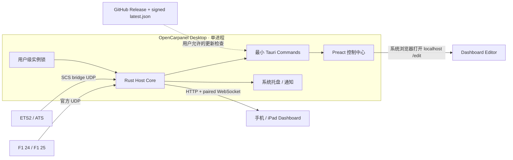
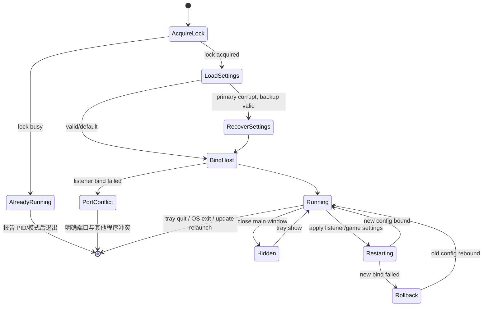

# OpenCarpanel v0.2.0 桌面控制中心设计

- **状态：** Accepted
- **日期：** 2026-08-12
- **目标平台：** Windows x64、macOS x64/Apple Silicon
- **默认入口：** Tauri 2 GUI
- **兼容入口：** 独立无头 CLI

## 1. 产品结论

v0.2.0 把 OpenCarpanel 从“终端 Host + 手机网页”升级为“桌面控制中心 + 手机仪表盘”。桌面端负责可发现性、安装与诊断；高频遥测仍沿用游戏 → Rust Host → 局域网 WebSocket → 手机/iPad 的数据面。运行时不需要 OpenCarpanel 远程服务器，只有用户允许时的 GitHub Release 更新检查访问互联网。

桌面视觉采用 **Pit Wall Control Room**：深色仪器台、按当前游戏变化的信号色、清晰的链路状态和高密度但不拥挤的诊断信息。动效只使用 opacity/transform/自定义属性，状态刷新与装饰动画不触发布局抖动，并完整支持 `prefers-reduced-motion`。

## 2. 进程与组件



安装目录同时包含：

```text
OpenCarpanel/
├─ OpenCarpanel Desktop(.exe/.app)   # 默认有头入口，内嵌 Host
├─ opencarpanel-host(.exe)           # 独立无头入口
├─ resources/plugins/scs/            # 当前平台 SCS bridge
├─ resources/docs/
├─ LICENSE
└─ NOTICE
```

GUI 不启动 CLI。两者只是指向相同 Rust Host library 的两个入口。

## 3. 模块边界

| 模块 | 所有权 | 不允许做的事 |
| --- | --- | --- |
| `apps/host` library | listener、adapter、配对、设备、诊断、实例锁、生命周期 | 依赖 Tauri 或 WebView |
| `apps/host` binary | CLI 参数/env、终端二维码、Ctrl+C | 启动 GUI |
| `apps/desktop/src-tauri` | Tauri lifecycle、tray、dialog、autostart、notification、updater | 解析游戏数据、复制前端传入的任意目标路径 |
| `apps/desktop/src` | 控制中心呈现、表单和可访问交互 | 直接读取文件系统、保存 secret、访问远程 runtime API |
| `crates/config` | 版本化 settings/layout、原子写、备份恢复 | 依赖 OS UI 或游戏 adapter |
| `web/dashboard` | 手机驾驶页与布局编辑器 | 获得 Tauri capabilities |

Tauri command 是 control plane，不进入每包遥测热路径。状态页每 500 ms 读取一次无锁 counters；手机 snapshot 仍按独立 WebSocket/rAF 预算运行。

## 4. 单实例与启动状态机



锁文件不在退出时删除，避免 Unix inode 竞争；进程只持有文件句柄，操作系统在崩溃后自动释放。成功持锁后才 bind 网络，因此错误可以区分 OpenCarpanel 重复运行和第三方端口占用。`OPENCARPANEL_RUNTIME_DIR` 仅用于测试/开发隔离。

## 5. 控制中心信息架构

| 区域 | 首版能力 |
| --- | --- |
| 总览 | Host、游戏自动识别、UDP/手机链路、数据龄、包计数、快速打开仪表盘 |
| 配对 | 一次性 15 分钟二维码、LAN 地址、已配对设备列表、单设备/全部撤销 |
| 游戏向导 | F1 24/F1 25 UDP 参数；ETS2/ATS 路径选择、插件检查、带备份的安装/更新 |
| 仪表盘 | 在浏览器打开驾驶页/编辑器，解释按游戏自动布局与移动设备访问地址 |
| 网络 | HTTP/UDP bind、20/30/60 Hz 上限、auto/固定 adapter；校验并监督重启 |
| 系统 | 关闭到托盘、开机启动、通知、更新开关、手动检查/安装 |
| 诊断 | 脱敏运行指标、版本/端口、日志尾部、诊断 JSON 导出、打开日志目录 |

首次启动显示三步向导但不阻断 Host：选择游戏 → 验证数据入口 → 手机扫码。之后记住完成状态，所有步骤仍可从游戏向导重新进入。

## 6. 持久化模型

```text
<application-data>/OpenCarpanel/
├─ settings.json               # Host + Desktop 偏好，版本化
├─ clients.json                # 仅 session SHA-256 digest 与设备元数据
├─ layouts/
├─ backups/
├─ quarantine/
└─ logs/                       # 最多 7 个滚动文件
```

- 设置保存前校验 socket address、端口、adapter 和频率；同目录原子替换并保留三份备份。
- 设备 session 本身只返回到手机 localStorage；磁盘只存 256-bit session 的 SHA-256 digest、随机设备 ID、受限名称和时间戳。
- 配对 token 一次有效、短时过期且只在内存中；不会进入日志或诊断导出。
- 设置损坏时隔离原文件并恢复最新有效备份；无备份时使用安全默认值并在 GUI 告警。

## 7. SCS 插件安装边界

用户通过系统目录选择器授予一个 ETS2/ATS 路径。Rust 端将其归一化为允许的 64-bit plugin 目录，只接受当前平台的 `.dll`/`.dylib`，拒绝符号链接逃逸与非预期目标。安装流程为：检查内嵌 artifact → 计算 SHA-256 → 创建目录 → 现有不同文件备份 → 临时文件复制与 flush → 原子替换 → 重新计算并比对。GUI 展示 `missing/current/outdated/invalid`，不声称能绕过游戏的 SDK 确认。

Steam 默认目录只用于只读建议；最终目标始终显示给用户。macOS/Windows 各自产物只携带对应架构插件。

## 8. 更新信任模型

1. 默认每日最多自动检查一次，用户可以完全关闭；手动检查始终明确显示网络行为。
2. endpoint 固定为项目 GitHub Release 的 HTTPS `latest.json`。
3. Tauri updater 使用编译内公钥验证 artifact 签名；此校验不可关闭。
4. 私钥与密码只进入 GitHub Actions secrets 和所有者的离线加密备份，不提交仓库、不写日志。
5. 下载/签名校验失败不执行 installer；当前版本继续运行。安装前等待 Host 优雅关闭并由 updater relaunch。
6. `latest.json` 只在所有目标 artifact 上传成功后发布；缺少任一声明平台则发布 job 失败。
7. Windows Authenticode 与 macOS Developer ID/notarization 未配置时，版本只能标记为 unsigned preview；updater 签名不能替代平台信任链。

## 9. 威胁与隐私

| 威胁 | 控制 |
| --- | --- |
| 恶意/被注入的桌面前端 | 严格 CSP、无 CDN、固定 command allowlist、Rust 再校验参数、最小 capability |
| localhost Dashboard 获得桌面权限 | 仅系统浏览器打开；不配置 remote capability |
| 目录穿越覆盖任意文件 | 原生选择器 + canonicalize + 游戏专属目标推导 + 原子备份 |
| 配对凭据泄漏 | token 位于 URL fragment；日志脱敏；磁盘仅 session digest |
| 伪造更新 | HTTPS + 编译内公钥 + artifact signature；私钥不进仓库 |
| UDP 畸形输入导致崩溃 | 现有长度/版本验证、无 `unsafe`、有界 datagram/队列 |
| 诊断泄漏隐私 | 不导出 token/session/IP/玩家名/原始 UDP；路径默认以用途标签代替 |

## 10. 非功能预算

| 指标 | v0.2.0 门禁 |
| --- | --- |
| UDP → 手机 WebSocket p95 | `< 100 ms`，保持 v0.1 release benchmark |
| 手机驾驶页 | 60 FPS 基线，高刷设备尽力 120 FPS，遥测不触发 Preact 全树重渲染 |
| 桌面 UI | 交互帧 p95 `< 16.7 ms`；后台/隐藏时停止装饰动画 |
| Headless RSS | 目标 `< 50 MiB` |
| Headed RSS | Windows/macOS 分别记录，目标 `< 120 MiB`，不以 Electron 基线替代实测 |
| 稳定性 | 2 h / 4 client / 60 Hz soak；窗口反复隐藏/显示与 Host 重启无句柄增长 |
| 启动 | lock 冲突在 listener bind 前失败；冷启动到 Host ready 目标 `< 2 s` |
| 包体 | 每平台记录 GUI installer、CLI 和 updater artifact 大小 |

## 11. 故障策略

| 故障 | 用户可见结果 | 恢复 |
| --- | --- | --- |
| 已有 GUI/CLI | 原生错误或 stderr，显示持有者信息后退出 | 从托盘打开现有实例或先退出 |
| HTTP/UDP 端口被其他程序占用 | 指明 service/address，不误报重复实例 | 修改设置或退出占用程序 |
| Host 长任务异常退出 | 托盘变红、通知与日志记录；GUI 保持可操作 | 用户一键重启 Host；不可自动无限重启 |
| 新设置无法 bind | 显示新错误并尝试恢复旧设置 | 旧设置重绑定成功则继续运行 |
| 配置/设备文件损坏 | 隔离坏文件，不让整个应用崩溃 | 从有效备份恢复或安全重置 |
| SCS 插件安装中断 | 不替换现有有效插件 | 保留备份，下一次重新安装 |
| 更新下载/验签失败 | 当前版本继续运行 | 显示可重试错误，不循环重启 |
| 托盘初始化失败 | 主窗口仍可运行并明确告警 | 关闭窗口改为真正退出，避免无界面常驻 |

## 12. 验收边界

自动化覆盖共享实例锁、设置恢复、设备撤销、目录归一化、Host restart rollback、Tauri command 序列化、前端交互、包内 CLI/GUI 共存和 updater manifest 完整性。真实 Windows/macOS 安装、系统托盘、开机启动、通知权限、游戏插件加载、手机扫码、平台签名与更新跨版本安装必须在发布清单中如实标记，不能由 mock 代替。
